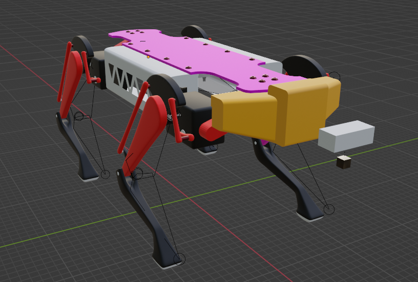
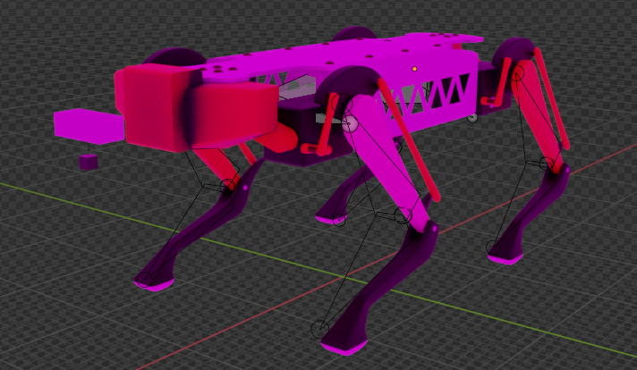

# REX: The Self-Navigating AI-based Quadruped Robot

### Project Overview
**REX** is a cost-effective quadruped robot developed to tackle versatile applications. It leverages servo motors, sonar sensors, and 3D-printed components to achieve autonomous navigation across challenging terrains. With the integration of **YOLO technology** for object detection and **cloud computing** for data processing, REX can effectively map environments and make real-time decisions for path optimization. This makes it suitable for tasks such as:
- Search and rescue missions
- Exploration of remote areas
- Military reconnaissance

---

## Key Features
- **Autonomous Navigation**: Uses sonar sensors and real-time object detection via YOLO to navigate.
- **Adaptable Movements**: The robotic quadruped is designed to adjust its walking pattern based on sensory input from the environment.
- **3D-Printed Design**: All mechanical components are designed to be affordable and easily replaceable, thanks to 3D printing.
- **Servo Motor-Driven Legs**: Precise control over each leg using servo motors enables smooth movement and agility over rough terrain.
- **Cloud Integration**: Powered by cloud computing, allowing REX to offload intensive tasks like environment mapping and path optimization.

---

## Project Structure
Since the implementation of REX is private, the source code, hardware designs, and model configurations are not publicly available in this repository.

However, if you are interested in collaborating or reviewing the implementation details, please feel free to reach out. We will provide the necessary files upon request.

---

## Installation and Setup (Available Upon Request)
All the setup instructions and code details, including prerequisites, configuration, and running the robot, can be shared on request.

To request access to the code and implementation:
- Please contact me via GitHub or email (provide your contact details here).

---

## Visuals

Here are some images of REX in development:

*Initial 3D model of REX showcasing its quadruped design.*

*Detailed view of some key components of REX.*

---

## Contributions
Although the code is private, we welcome discussions and ideas on improving the REX project. If you would like to contribute or collaborate, feel free to get in touch!

---

## License
This project is licensed under the MIT License - see the [LICENSE](LICENSE) file for details.

---

## Acknowledgments
This project was developed under the guidance of **Dr. Arshad Ali, PhD**, at **FAST-NU**. Special thanks to everyone involved in the design, testing, and implementation of REX.
