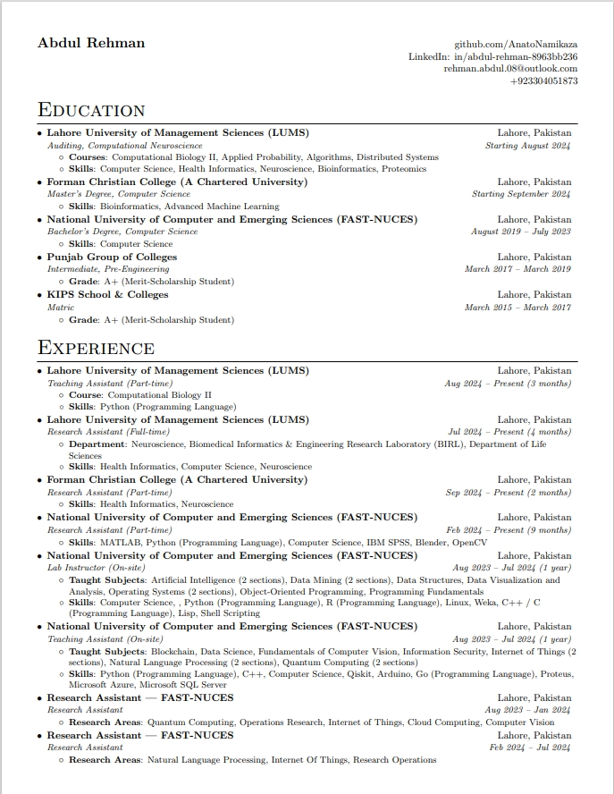

## Preview

## Getting Started

To get started, follow the below listed steps.

1 - Clone the repository

2 - Go to [overleaf.com](https://overleaf.com) and create a new project.

3 - Upload the file `resume.tex` from the `src/` folder to the project.

4 - Compile the project and you're good to go!